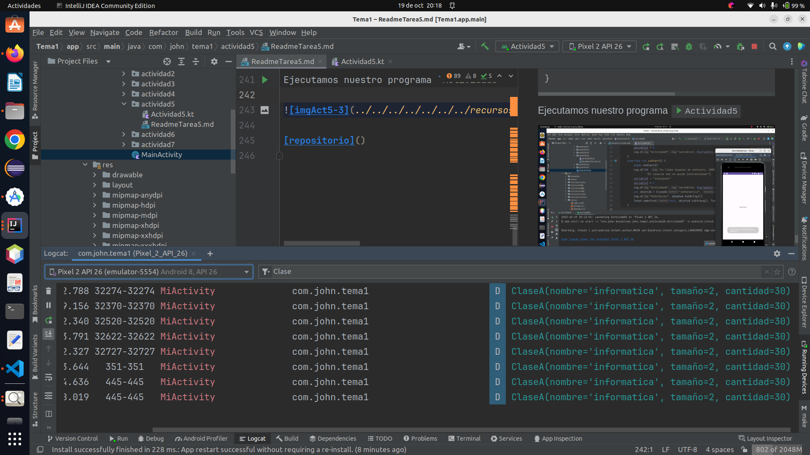

# Actividad 1
- Instalar el entorno de programación y recorrer cada uno de los recursos.
- Crear un recurso de imagen.

1. Descargamos Android Studio:
* Descarga Android Studio desde el sitio web oficial: 
[https://developer.android.com/studio](https://developer.android.com/studio).


* Sigue las instrucciones de instalación específicas para tu sistema operativo.

### Inicia Android Studio:

* Abre Android Studio después de la instalación.
* Puedes configurar tu entorno y seleccionar las opciones según tus preferencias.

### Crea un nuevo proyecto:

    En Android Studio, selecciona "File" (Archivo) -> "New" (Nuevo) -> 
    "New Project" (Nuevo Proyecto).
    Sigue los pasos del asistente para crear un nuevo proyecto. Esto 
    incluirá seleccionar el tipo de proyecto y configurar las opciones de inicio.

### Explora el proyecto:

    Una vez que hayas creado el proyecto, puedes explorar la estructura 
    de directorios. Los recursos, como imágenes, se almacenan en la carpeta
    res (recursos) de tu proyecto.

### Crear un recurso de imagen:

    Abre la carpeta res en tu proyecto y busca la carpeta drawable.
    Haz clic derecho en la carpeta drawable y selecciona "New" (Nuevo) 
    -> "Image Asset" (Recurso de imagen).
    Aparecerá una ventana que te permitirá importar una imagen o crear
    una desde cero. Puedes seleccionar la imagen que desees y personalizar
    las opciones de generación.

### Personaliza el recurso de imagen:

    Android Studio te permitirá personalizar la imagen, como el nombre del
    recurso y las densidades para generar automáticamente versiones adaptadas
    a diferentes tamaños de pantalla.

### Usa el recurso de imagen:

    Puedes usar tu nuevo recurso de imagen en tu aplicación accediendo a él
    en el código XML o Java de tu proyecto.

# Actividad 4


1. Trabajar con el manifest. Por ejemplo, declarar un segundo activity. Con un intent-filter, 
   jugar a cambiar como primera pantalla el nuevo Activity.

* Acceder a la documentación que os he dejado sobre Manifest y verificar cada una de las opciones.


### 1: Trabajar con el manifest


### Creamos la Activity *actividad4*
```kotlin
class Actividad4 : AppCompatActivity() {
    override fun onCreate(savedInstanceState: Bundle?) {
        super.onCreate(savedInstanceState)
        setContentView(R.layout.activity_actividad4)
    }
}
```

Modificamos `themes.xml` que se encuentra en res/values/themes


```xml
<resources xmlns:tools="http://schemas.android.com/tools">
    <!-- Base application theme. -->
    <!-- Definir un nuevo color -->
    <color name="colorPrimary">#4BFF22</color>

    <!-- Definir otro color -->
    <color name="colorAccent">#CDDC39</color>
    <style name="Base.Theme.Tema1" parent="Theme.Material3.DayNight.NoActionBar">
        <!-- Customize your light theme here. -->
        <!-- <item name="colorPrimary">@color/my_light_primary</item> -->
        <item name="colorPrimary">@color/colorPrimary</item>
        <item name="colorPrimaryDark">#009688</item>
        <item name="colorAccent">@color/colorAccent</item>
    </style>

</resources>
```

En el androidManifest agregamos el thema
```codigo
android:theme="@style/Base.Theme.Tema1"
```

```xml
<?xml version="1.0" encoding="utf-8"?>
<manifest xmlns:android="http://schemas.android.com/apk/res/android"
    xmlns:tools="http://schemas.android.com/tools">

    <application
        android:allowBackup="true"
        android:dataExtractionRules="@xml/data_extraction_rules"
        android:fullBackupContent="@xml/backup_rules"
        android:icon="@mipmap/ic_launcher"
        android:label="@string/app_name"
        android:roundIcon="@mipmap/ic_launcher_round"
        android:supportsRtl="true"
        android:theme="@style/Base.Theme.Tema1"
        tools:targetApi="31">
        
        <activity
            android:name=".actividad4.Actividad4"
            android:exported="true">
            <intent-filter>
                <action android:name="android.intent.action.MAIN" />

                <category android:name="android.intent.category.LAUNCHER" />
            </intent-filter>
        </activity>
      
        <activity
            android:name=".MainActivity"
            android:exported="true">
            <intent-filter>
                <action android:name="android.intent.action.MAIN" />

                <category android:name="android.intent.category.LAUNCHER" />
            </intent-filter>
        </activity>
      
    </application>

</manifest>
```

Ejecutamos nuestro programa `Actividad4`


Vemos  que el thema cambia de colo.


Vemos que el thema cambia de color.


# Actividad 5

1.- Trabajar con el ciclo de vida de un activity. Sobreescribiremos todos los métodos del ciclo de 
vida y mediante Log, capturaremos lo que sucede.

2.- Realizar un debugger. Para ello:

* Crearos un par de variables y modificarla en cada uno de los métodos del activity. Ir ejecutando 
  paso a paso y comprobando el estado de dichas variables.

3.- Crearos una clase llamada ClaseA que tenga tres atributos. Codificar dos constructores, los 
getters/setters y el toString. Desde el método onStart(), crearos un objeto de la claseA, sesearlo
y realizar un Toast. Poner puntos de ruptura en cada método de la claseA y utilizar las opciones de
la depuración.

### 1: Trabajar con el Ciclo de Vida de un Activity

Sobreescribiremos todos los métodos del ciclo de vida de un Activity y utilizaremos Log para 
capturar lo que sucede en cada uno de ellos. A continuación, se muestra un ejemplo de cómo hacerlo:

### Creamos la Activity *actividad5*
```kotlin
private const val TAG = "vistaActiv"
class Actividad5 : AppCompatActivity() {
    override fun onCreate(savedInstanceState: Bundle?) {
        super.onCreate(savedInstanceState)
        setContentView(R.layout.activity_actividad5)
    }
    override fun onStart() {
        super.onStart()
        Log.d(TAG, "Se llama después de onCreate. JOHN, muestro la pantalla. " +
                "El usuario aún no puede interaccionar")
    }
    override fun onResume() {
        super.onResume()
        Log.d(TAG, "El usuario ya puede interaccionar con la pantalla")
    }
    override fun onPause() {
        super.onPause()
        Log.d(TAG, "Pierdo el foco de la pantalla. Boton home")
    }
    override fun onRestart() {
        super.onRestart()
        Log.d(TAG, "Vuelvo a estar visible para JOHN.")
    }
    override fun onStop() {
        super.onStop()
        Log.d(TAG, "Dejo de estar visible para el usuario. Otra App, S.O.")
    }
    override fun onDestroy() {
        super.onDestroy()
        Log.d(TAG, "La actividad muere.")
    }

}
```

Ejecutamos nuestro programa `Actividad5`


2: Realizar un Debugger

Creamos un par de variables en la Activity y las modificamos en cada uno de los métodos del 
ciclo de vida.
Luego, utilizamos el modo de depuración para ejecutar paso a paso y comprobar el estado de 
esas variables.

Por ejemplo:

```kotlin
private const val TAG = "vistaActiv"
class Actividad5 : AppCompatActivity() {
    private  var variable1 = "inicio"
    private  var variable2 = 5
    override fun onCreate(savedInstanceState: Bundle?) {
        super.onCreate(savedInstanceState)
        setContentView(R.layout.activity_actividad5)
        variable1 = "se crea una instancia"
        variable2 = 0
        Log.d("Actividad5","variable1: $variable1,variable2: $variable2")
    }
    override fun onStart() {
        super.onStart()
        Log.d(TAG, "Se llama después de onCreate. JOHN, muestro la pantalla. " +
                "El usuario aún no puede interaccionar")
        variable1 = "iniciamos"
        variable2 = 1
        Log.d("Actividad5","variable1: $variable1,variable2: $variable2")
    }
    override fun onResume() {
        super.onResume()
        Log.d(TAG, "El usuario ya puede interaccionar con la pantalla")
        variable1 = "reactivamos"
        variable2 = 2
        Log.d("Actividad5","variable1: $variable1,variable2: $variable2")
    }
    override fun onPause() {
        super.onPause()
        Log.d(TAG, "Pierdo el foco de la pantalla. Boton home")
        variable1 = "pausamos"
        variable2 = 3
        Log.d("Actividad5","variable1: $variable1,variable2: $variable2")
    }
    override fun onRestart() {
        super.onRestart()
        Log.d(TAG, "Vuelvo a estar visible para JOHN.")
        variable1 = "Reiniciamos"
        variable2 = 4
        Log.d("Actividad5","variable1: $variable1,variable2: $variable2")
    }
    override fun onStop() {
        super.onStop()
        Log.d(TAG, "Dejo de estar visible para el usuario. Otra App, S.O.")
        variable1 = "paramos"
        variable2 = 5
        Log.d("Actividad5","variable1: $variable1,variable2: $variable2")
    }
    override fun onDestroy() {
        super.onDestroy()
        Log.d(TAG, "La actividad muere.")
        variable1 = "destruimos"
        variable2 = 6
        Log.d("Actividad5","variable1: $variable1,variable2: $variable2")
    }

}
```

Ejecutamos nuestro programa `Actividad5`


### 3: Crear una Clase Personalizada

Crearemos una clase personalizada llamada ClaseA. La clase tendrá tres atributos, dos constructores,
métodos getter/setter y una implementación del método toString. Luego, desde el método onStart() del
Activity, se creará un objeto de ClaseA, se configurará y se mostrará en un Toast. Se colocarán 
puntos de ruptura en cada método de ClaseA y se utilizarán las opciones de depuración para 
inspeccionar su comportamiento.

Por ejemplo:

```kotlin
private const val TAG = "vistaActiv"
class Actividad5 : AppCompatActivity() {
    private  var variable1 = "inicio"
    private  var variable2 = 5
    override fun onCreate(savedInstanceState: Bundle?) {
        super.onCreate(savedInstanceState)
        setContentView(R.layout.activity_actividad5)
        variable1 = "se crea una instancia"
        variable2 = 0
        Log.d("Actividad5","variable1: $variable1,variable2: $variable2")
    }
    override fun onStart() {
        super.onStart()
        Log.d(TAG, "Se llama después de onCreate. JOHN, muestro la pantalla. " +
                "El usuario aún no puede interaccionar")
        variable1 = "iniciamos"
        variable2 = 1
        Log.d("Actividad5","variable1: $variable1,variable2: $variable2")
        val objetoA = ClaseA("informatica", 2, 30)
        Log.d("MiActivity", objetoA.toString())
        Toast.makeText(this, objetoA.toString(), Toast.LENGTH_SHORT).show()
    }

    override fun onResume() {
        super.onResume()
        Log.d(TAG, "El usuario ya puede interaccionar con la pantalla")
        variable1 = "reactivamos"
        variable2 = 2
        Log.d("Actividad5","variable1: $variable1,variable2: $variable2")
    }
    override fun onPause() {
        super.onPause()
        Log.d(TAG, "Pierdo el foco de la pantalla. Boton home")
        variable1 = "pausamos"
        variable2 = 3
        Log.d("Actividad5","variable1: $variable1,variable2: $variable2")
    }
    override fun onRestart() {
        super.onRestart()
        Log.d(TAG, "Vuelvo a estar visible para JOHN.")
        variable1 = "Reiniciamos"
        variable2 = 4
        Log.d("Actividad5","variable1: $variable1,variable2: $variable2")
    }
    override fun onStop() {
        super.onStop()
        Log.d(TAG, "Dejo de estar visible para el usuario. Otra App, S.O.")
        variable1 = "paramos"
        variable2 = 5
        Log.d("Actividad5","variable1: $variable1,variable2: $variable2")
    }
    override fun onDestroy() {
        super.onDestroy()
        Log.d(TAG, "La actividad muere.")
        variable1 = "destruimos"
        variable2 = 6
        Log.d("Actividad5","variable1: $variable1,variable2: $variable2")
    }

}
class ClaseA{
    private var nombre = "clase1"
        get() {
            return field
        }
        set(value) {
            field = value
        }
    private var tamaño = 0
        get() {
            return field
        }
        set(value) {
            field = value
        }
    private var cantidad = 0
        get() {
            return field
        }
        set(value) {
            field = value
        }

    constructor(nombre: String, tamaño: Int, cantidad: Int) {
        this.nombre = nombre
        this.tamaño = tamaño
        this.cantidad = cantidad
    }

    constructor()

    override fun toString(): String {
        return "ClaseA(nombre='$nombre', tamaño=$tamaño, cantidad=$cantidad)"
    }


}
```

Ejecutamos nuestro programa `Actividad5`





# Actividad 6

* Crearemos nuestro primer layout, pero emplearemos un color de fondo y un textView junto a un 
botón. Por ahora con un LinearLayout
* Jugar con los tamaños de textos.

### Creamos la Activity *actividad6*
```kotlin
class Actividad6 : AppCompatActivity() {
    private lateinit var boton : Button
    private lateinit var txtSaludo : TextView
    override fun onCreate(savedInstanceState: Bundle?) {
        super.onCreate(savedInstanceState)
        setContentView(R.layout.activity_actividad6)

        boton = findViewById(R.id.boton)
        txtSaludo = findViewById(R.id.text)
    }
    fun pulsarBoton(v : View){
        Toast.makeText(this,"que haces?", Toast.LENGTH_SHORT).show();
        txtSaludo.text = "Cambio de texto"
    }
}
```
## Creación del Layout XML:

<p>Abre el directorio de recursos de tu proyecto de Android en el explorador de archivos. 
Normalmente se encuentra en la carpeta res. Allí, crea un nuevo archivo XML para el diseño 
(por ejemplo, activity_mi_layout.xml) o modifica un archivo XML existente si prefieres. El 
diseño podría verse de la siguiente manera:</p><br>

```xml
<?xml version="1.0" encoding="utf-8"?>

<android:LinearLayout
        xmlns:app="http://schemas.android.com/apk/res-auto"
        xmlns:tools="http://schemas.android.com/tools" xmlns:android="http://schemas.
                        android.com/apk/res/android"
        android:layout_width="match_parent"
        android:layout_height="match_parent"
        android:orientation="vertical"
        android:background="#4FA453"
        tools:context=".actividad6.Actividad6" layout_height="match_parent" 
                        layout_width="match_parent">
    <TextView
            android:id="@+id/text"
            android:layout_width="match_parent"
            android:layout_height="wrap_content"
            android:text="¡Hola, Android!"
            android:textSize="24sp"
            android:textColor="#000000"
            android:background="#AAA562"
            android:gravity="center" />
    <Button
            android:id="@+id/boton"
            android:layout_width="match_parent"
            android:layout_height="wrap_content"
            android:text="Presionar"
            android:textSize="18sp" 
            android:backgroundTint="#FFF1"
            android:textColor="#C20847"
            android:onClick="pulsarBoton" />
</android:LinearLayout>
```

## Personalización
Puedes personalizar el diseño ajustando los siguientes atributos:
- `android:background`: Cambia el color de fondo del diseño.
- `android:textSize`: Modifica el tamaño del texto en `TextView` y el botón.
- `android:text`: Cambia el texto en `TextView` y el botón.
- `android:textColor`: Ajusta el color del texto en `TextView` y el botón.

Ejecutamos nuestro programa `Actividad6`


# Actividad 7

1. Trabajaremos con los eventos de los botones. Implementaremos un ejemplo, con tres botones.

    * saludar
    * no saludar
    * saludar a clase

* Tendremos que jugar con las tres formas de tratar los eventos de los botones:

    * Implementar dentro del xml, el método onclick="capturarEvento" en cada botón y desde la clase 
    MainActivity, debemos de implementar ese método comprobando el "id" de cada uno de los botones.

    * Ahora toca hacerlo a partir del MainActivity, implementar de la interfaz ActionListener, por 
    tanto debemos sobreescribir de manera explítica el método onclick(view:View). Dentro hay que 
    comprobar el id de cada uno de los tres botones. Recordar que debemos quitar de cada botón la 
    propiedad onclick. También, que hay que hacer un btn_1.setActionListener(this), 
    tbn_2.setActionListener(this), tbn_3.setActionListener(this). La bala/cartucho, es el propio 
    MainActivity.

    * Ahora toca con expresiones lambda. A cada botón, hay que cargarle su actionListener de manera
    individual, por tanto ponemos la expresión que hay que ejecutar en la invocación del onclick.

    * Realizar, capturas de pantalla personalizadas de las tres formas. Jugar con esto.

## Modo 1

### Creamos la Activity *actividad7*

```kotlin

class Actividad7 : AppCompatActivity() {
    private lateinit var btnSaludo : Button
    private lateinit var txtSaludar : TextView
    private lateinit var botonNoSaludar : Button
    private lateinit var botonSaludarClase : Button
    override fun onCreate(savedInstanceState: Bundle?) {
        super.onCreate(savedInstanceState)
        setContentView(R.layout.activity_actividad7)
        btnSaludo = findViewById(R.id.btnSaludar)
        txtSaludar = findViewById(R.id.txt_saludar)
        botonNoSaludar = findViewById(R.id.botonNoSaludar)
        botonSaludarClase = findViewById(R.id.btn_saludar_clase)

        initEvent()
    }
    private fun initEvent(){
        btnSaludo.setOnClickListener {
            Toast.makeText(this,"Hola john!!!!", Toast.LENGTH_LONG).show()
            txtSaludar.text = "Hola john como estas!!!!"
        }
        botonNoSaludar.setOnClickListener {
            Toast.makeText(this,"No quiero saludar a john!!!! ", Toast.LENGTH_LONG).show()
            txtSaludar.text = "No quiero saludar a john!!!!!!"
        }

        botonSaludarClase.setOnClickListener {
            Toast.makeText(this,"Os saludo, clase PMDM 23/24!!!!!!",Toast.LENGTH_LONG).show()
            txtSaludar.text= "Os saludo, clase PMDM 23/24!!!!!"
        }

    }

}
```
En el archivo xml de la actividad7 agregamos los botones y el Textview:

```xml
    <Button
        android:id="@+id/btnSaludar"
        android:layout_width="wrap_content"
        android:layout_height="wrap_content"
        android:text="@string/btnSaludar"
        app:layout_constraintBottom_toBottomOf="parent"

        app:layout_constraintEnd_toEndOf="parent"
        app:layout_constraintHorizontal_bias="0.5"
        app:layout_constraintStart_toStartOf="parent"
        app:layout_constraintTop_toTopOf="parent"
        app:layout_constraintVertical_bias="0.300" />

    <TextView
        android:id="@+id/txt_saludar"
        android:layout_width="wrap_content"
        android:layout_height="wrap_content"
        android:text="@string/hola"
        app:layout_constraintBottom_toBottomOf="parent"
        app:layout_constraintEnd_toEndOf="parent"
        app:layout_constraintHorizontal_bias="0.500"
        app:layout_constraintStart_toStartOf="parent"
        app:layout_constraintTop_toTopOf="parent"
        app:layout_constraintVertical_bias="0.100" />

    <Button
        android:id="@+id/botonNoSaludar"
        android:layout_width="wrap_content"
        android:layout_height="wrap_content"
        android:text="@string/no_saludar"
        app:layout_constraintBottom_toBottomOf="parent"

        app:layout_constraintEnd_toEndOf="parent"
        app:layout_constraintHorizontal_bias="0.5"
        app:layout_constraintStart_toStartOf="parent"
        app:layout_constraintTop_toTopOf="parent"
        app:layout_constraintVertical_bias="0.500"  />

    <Button
        android:id="@+id/btn_saludar_clase"
        android:layout_width="wrap_content"
        android:layout_height="wrap_content"
        android:text="@string/clase"
        app:layout_constraintBottom_toBottomOf="parent"

        app:layout_constraintEnd_toEndOf="parent"
        app:layout_constraintHorizontal_bias="0.5"
        app:layout_constraintStart_toStartOf="parent"
        app:layout_constraintTop_toTopOf="parent"
        app:layout_constraintVertical_bias="0.700"  />
```
También en el fichero `strings.xml`, en la carpeta values le damos
nombre a nuestros botones:

```xml
<resources>
    <string name="btnSaludar">Saludar a john</string>
    <string name="hola">!Hello Word</string>
    <string name="app_name">aplicacion</string>
    <string name="no_saludar">No Saludar a John</string>
    <string name="clase">Saludar a Clase</string>
</resources>
```
Ejecutamos nuestro programa `Actividad7`


Ahora vamos a pulsar en el boton `saludar a john`:


Vemos que al pulsar el boton `saludar a john` se muestra el mensaje
en pantalla.

Ahora vamos a pulsar en el boton `no saludar a john`:


Vemos que al pulsar el boton `no saludar a john` se muestra el mensaje
en pantalla.


Ahora vamos a pulsar en el boton `saludar a clase`:


Vemos que al pulsar el boton `saludar a clase` se muestra el mensaje
en pantalla.

## Descripción
Esta actividad de Android es parte de una aplicación móvil y proporciona una interfaz de usuario 
simple con botones y un TextView. Los botones permiten al usuario interactuar con la aplicación 
haciendo clic en ellos y generando mensajes de saludo o de otro tipo en función de la acción 
realizada.

## Componentes de la Actividad
- `btnSaludo`: Un botón que genera un mensaje de saludo cuando se hace clic en él.
- `txtSaludar`: Un TextView que muestra mensajes de saludo.
- `botonNoSaludar`: Un botón que genera un mensaje cuando el usuario decide no saludar.
- `botonSaludarClase`: Un botón que saluda a una clase específica.

## Funcionamiento
1. Cuando la actividad se crea, se inicializan los componentes de la interfaz de usuario y se 
configuran los eventos.

2. Cuando el botón `btnSaludo` se presiona, se muestra un mensaje de saludo "Hola John!!!!" en un 
cuadro de mensaje emergente (Toast) y se actualiza el contenido del `txtSaludar` con "Hola John 
como estas!!!!".

3. Cuando el botón `botonNoSaludar` se presiona, se muestra un mensaje "No quiero saludar a 
John!!!!" en un cuadro de mensaje emergente y se actualiza el contenido de `txtSaludar` con 
"No quiero saludar a John!!!!!!".

4. Cuando el botón `botonSaludarClase` se presiona, se muestra un mensaje "Os saludo, clase PMDM 
23/24!!!!!!" en un cuadro de mensaje emergente y se actualiza el contenido de `txtSaludar` con 
"Os saludo, clase PMDM 23/24!!!!!".


## Notas
- Este código está escrito en lenguaje Kotlin, que es el lenguaje de programación oficial para el 
desarrollo de aplicaciones de Android.
- Los mensajes de saludo y otros mensajes se muestran en cuadros de mensaje emergente (Toast) para 
proporcionar una experiencia interactiva al usuario.


## Modo 2

### Creamos la Activity *actividad7Modo2*

```kotlin
class Actividad7Modo2 : AppCompatActivity(), OnClickListener {
    private lateinit var btnSaludo : Button
    private lateinit var txtSaludar : TextView
    private lateinit var botonNoSaludar : Button
    private lateinit var botonSaludarClase : Button
    override fun onCreate(savedInstanceState: Bundle?) {
        super.onCreate(savedInstanceState)
        setContentView(R.layout.activity_actividad7_modo2)
        btnSaludo = findViewById(R.id.btnSaludar)
        txtSaludar = findViewById(R.id.txt_saludar)
        botonNoSaludar = findViewById(R.id.botonNoSaludar)
        botonSaludarClase = findViewById(R.id.btn_saludar_clase)

        botonSaludarClase.setOnClickListener(this)
        botonNoSaludar.setOnClickListener(this)
        btnSaludo.setOnClickListener(this)
    }


    override fun onClick(v1: View) {
        if(v1.id == R.id.btn_saludar_clase){
            Toast.makeText(this,"Os saludo, clase PMDM 23/24 !!!!",Toast.LENGTH_LONG).show()
            txtSaludar.text= "Os saludo, clase PMDM 23/24 !!!!"
        }
        if(v1.id == R.id.botonNoSaludar){
            Toast.makeText(this,"No quiero saludar a john!!!! ", Toast.LENGTH_LONG).show()
            txtSaludar.text = "No quiero saludar a john!!!!!!"
        }
        if(v1.id == R.id.btnSaludar){
            Toast.makeText(this,"Hola john!!!!", Toast.LENGTH_LONG).show()
            txtSaludar.text = "Hola john como estas!!!!"
        }

    }
}
```
En el archivo xml de la actividad7Modo2 agregamos los botones y el Textview:

```xml
    <Button
        android:id="@+id/btnSaludar"
        android:layout_width="wrap_content"
        android:layout_height="wrap_content"
        android:text="@string/btnSaludar"
        app:layout_constraintBottom_toBottomOf="parent"

        app:layout_constraintEnd_toEndOf="parent"
        app:layout_constraintHorizontal_bias="0.5"
        app:layout_constraintStart_toStartOf="parent"
        app:layout_constraintTop_toTopOf="parent"
        app:layout_constraintVertical_bias="0.300" />

    <TextView
        android:id="@+id/txt_saludar"
        android:layout_width="wrap_content"
        android:layout_height="wrap_content"
        android:text="@string/hola"
        app:layout_constraintBottom_toBottomOf="parent"
        app:layout_constraintEnd_toEndOf="parent"
        app:layout_constraintHorizontal_bias="0.500"
        app:layout_constraintStart_toStartOf="parent"
        app:layout_constraintTop_toTopOf="parent"
        app:layout_constraintVertical_bias="0.100" />

    <Button
        android:id="@+id/botonNoSaludar"
        android:layout_width="wrap_content"
        android:layout_height="wrap_content"
        android:text="@string/no_saludar"
        app:layout_constraintBottom_toBottomOf="parent"

        app:layout_constraintEnd_toEndOf="parent"
        app:layout_constraintHorizontal_bias="0.5"
        app:layout_constraintStart_toStartOf="parent"
        app:layout_constraintTop_toTopOf="parent"
        app:layout_constraintVertical_bias="0.500"  />

    <Button
        android:id="@+id/btn_saludar_clase"
        android:layout_width="wrap_content"
        android:layout_height="wrap_content"
        android:text="@string/clase"
        app:layout_constraintBottom_toBottomOf="parent"

        app:layout_constraintEnd_toEndOf="parent"
        app:layout_constraintHorizontal_bias="0.5"
        app:layout_constraintStart_toStartOf="parent"
        app:layout_constraintTop_toTopOf="parent"
        app:layout_constraintVertical_bias="0.700"  />
```
También en el fichero `strings.xml`, en la carpeta values le damos
nombre a nuestros botones:

```xml
<resources>
    <string name="btnSaludar">Saludar a john</string>
    <string name="hola">!Hello Word</string>
    <string name="app_name">aplicacion</string>
    <string name="no_saludar">No Saludar a John</string>
    <string name="clase">Saludar a Clase</string>
</resources>
```
Ejecutamos nuestro programa `Actividad7Modo2`


Ahora vamos a pulsar en el boton `saludar a john`:


Vemos que al pulsar el boton `saludar a john` se muestra el mensaje
en pantalla.

Ahora vamos a pulsar en el boton `no saludar a john`:


Vemos que al pulsar el boton `no saludar a john` se muestra el mensaje
en pantalla.


Ahora vamos a pulsar en el boton `saludar a clase`:


Vemos que al pulsar el boton `saludar a clase` se muestra el mensaje
en pantalla.

## Descripción
Este programa es una actividad de Android escrita en Kotlin que muestra una interfaz de usuario con 
botones y un TextView. La actividad responde a eventos de clic en los botones para mostrar mensajes 
de saludo y actualiza el contenido del TextView.

## Componentes de la Interfaz de Usuario
- `btnSaludo`: Un botón que genera un mensaje de saludo cuando se hace clic en él.
- `txtSaludar`: Un TextView que muestra mensajes de saludo.
- `botonNoSaludar`: Un botón que genera un mensaje cuando el usuario decide no saludar.
- `botonSaludarClase`: Un botón que saluda a una clase específica.

## Funcionamiento
1. **Declaración de Variables y Componentes de la Interfaz de Usuario:**
    - Se declaran las variables `btnSaludo`, `txtSaludar`, `botonNoSaludar` y `botonSaludarClase` 
      para representar los componentes de la interfaz de usuario.
    - Estas variables se declaran como propiedades `lateinit`, lo que significa que se inicializarán
      más tarde en el código.

2. **Inicialización de la Actividad:**
    - El método `onCreate` se ejecuta al crearse la actividad.
    - Se llama al constructor de la superclase `AppCompatActivity` para la inicialización básica.
    - Se configura el contenido de la actividad utilizando `setContentView` para asociarla con un 
      archivo de diseño (`activity_actividad7_modo2.xml`) que define la interfaz de usuario.

3. **Inicialización de Componentes de la Interfaz de Usuario:**
    - Se inicializan las variables `btnSaludo`, `txtSaludar`, `botonNoSaludar` y `botonSaludarClase`
      utilizando `findViewById` para enlazarlas con los elementos de la interfaz de usuario 
      definidos en el archivo de diseño.

4. **Asociación de Eventos de Clic:**
    - Se asocian eventos de clic a los botones utilizando `setOnClickListener(this)` debido a que 
      la actividad implementa la interfaz `OnClickListener`, lo que permite gestionar los eventos 
      de clic de manera estructurada.

5. **Gestión de Eventos de Clic (onClick):**
    - El método `onClick` se ejecuta cuando se hace clic en uno de los botones, y el parámetro `v1`
      de tipo `View` identifica el botón presionado.
    - Se utiliza una estructura condicional para determinar cuál de los botones se ha presionado 
      según su ID.

6. **Mensajes y Actualización de TextView:**
    - Según el botón presionado, se muestra un mensaje correspondiente utilizando `Toast.makeText`,
      que muestra un cuadro de mensaje emergente.
    - El contenido del `txtSaludar` se actualiza con un mensaje apropiado utilizando la propiedad 
     `text`.


## Notas
- Este código está escrito en lenguaje Kotlin, que es el lenguaje de programación oficial para el 
desarrollo de aplicaciones de Android.
- Los mensajes de saludo y otros mensajes se muestran en cuadros de mensaje emergente (Toast) para 
proporcionar una experiencia interactiva al usuario.

## Modo 3

### Creamos la Activity *actividad7Modo3*

```kotlin
class Actividad7Modo3 : AppCompatActivity() {
    private lateinit var btnSaludo : Button
    private lateinit var txtSaludar : TextView
    private lateinit var botonNoSaludar : Button
    private lateinit var botonSaludarClase : Button
    override fun onCreate(savedInstanceState: Bundle?) {
        super.onCreate(savedInstanceState)
        setContentView(R.layout.activity_actividad7_modo3)

        btnSaludo = findViewById(R.id.btnSaludar)
        txtSaludar = findViewById(R.id.txt_saludar)
        botonNoSaludar = findViewById(R.id.botonNoSaludar)
        botonSaludarClase = findViewById(R.id.btn_saludar_clase)

    }

    fun btnSaludar(v1: View) {
        if(v1.id == R.id.btnSaludar){
            Toast.makeText(this,"Hola john!!!!", Toast.LENGTH_LONG).show()
            txtSaludar.text = "Hola john como estas!!!!"
        }
        if(v1.id == R.id.botonNoSaludar){
            Toast.makeText(this,"No quiero saludar a john!!!! ", Toast.LENGTH_LONG).show()
            txtSaludar.text = "No quiero saludar a john!!!!!!"
        }
        if(v1.id == R.id.btn_saludar_clase){
            Toast.makeText(this,"Os saludo, clase PMDM 23/24 !!!!",Toast.LENGTH_LONG).show()
            txtSaludar.text= "Os saludo, clase PMDM 23/24 !!!!"
        }
    }

}
```
En el archivo xml de la actividad7Modo3 agregamos los botones y el Textview:

```xml
    <Button
        android:id="@+id/btnSaludar"
        android:layout_width="wrap_content"
        android:layout_height="wrap_content"
        android:text="@string/btnSaludar"
        android:onClick="btnSaludar"
        app:layout_constraintBottom_toBottomOf="parent"

        app:layout_constraintEnd_toEndOf="parent"
        app:layout_constraintHorizontal_bias="0.5"
        app:layout_constraintStart_toStartOf="parent"
        app:layout_constraintTop_toTopOf="parent"
        app:layout_constraintVertical_bias="0.300" />

    <TextView
        android:id="@+id/txt_saludar"
        android:layout_width="wrap_content"
        android:layout_height="wrap_content"
        android:text="@string/hola"
        app:layout_constraintBottom_toBottomOf="parent"
        app:layout_constraintEnd_toEndOf="parent"
        app:layout_constraintHorizontal_bias="0.500"
        app:layout_constraintStart_toStartOf="parent"
        app:layout_constraintTop_toTopOf="parent"
        app:layout_constraintVertical_bias="0.100" />
        
    <Button
        android:id="@+id/botonNoSaludar"
        android:layout_width="wrap_content"
        android:layout_height="wrap_content"
        android:text="@string/no_saludar"
        android:onClick="btnSaludar"
        app:layout_constraintBottom_toBottomOf="parent"
        
        app:layout_constraintEnd_toEndOf="parent"
        app:layout_constraintHorizontal_bias="0.5"
        app:layout_constraintStart_toStartOf="parent"
        app:layout_constraintTop_toTopOf="parent"
        app:layout_constraintVertical_bias="0.500"  />
        
    <Button
        android:id="@+id/btn_saludar_clase"
        android:layout_width="wrap_content"
        android:layout_height="wrap_content"
        android:text="@string/clase"
        android:onClick="btnSaludar"
        app:layout_constraintBottom_toBottomOf="parent"
        
        app:layout_constraintEnd_toEndOf="parent"
        app:layout_constraintHorizontal_bias="0.5"
        app:layout_constraintStart_toStartOf="parent"
        app:layout_constraintTop_toTopOf="parent"
        app:layout_constraintVertical_bias="0.700"  />

```
También en el fichero `strings.xml`, en la carpeta values le damos
nombre a nuestros botones:

```xml
<resources>
    <string name="btnSaludar">Saludar a john</string>
    <string name="hola">!Hello Word</string>
    <string name="app_name">aplicacion</string>
    <string name="no_saludar">No Saludar a John</string>
    <string name="clase">Saludar a Clase</string>
</resources>
```
Ejecutamos nuestro programa `Actividad7Modo3`


Ahora vamos a pulsar en el boton `saludar a john`:


Vemos que al pulsar el boton `saludar a john` se muestra el mensaje
en pantalla.

Ahora vamos a pulsar en el boton `no saludar a john`:


Vemos que al pulsar el boton `no saludar a john` se muestra el mensaje
en pantalla.


Ahora vamos a pulsar en el boton `saludar a clase`:


Vemos que al pulsar el boton `saludar a clase` se muestra el mensaje
en pantalla.

## Descripción
Este programa es una actividad de Android escrita en Kotlin que proporciona una interfaz de usuario
con botones y un TextView. La actividad responde a eventos de clic en los botones para mostrar 
mensajes de saludo y actualiza el contenido del TextView.

## Componentes de la Interfaz de Usuario
- `btnSaludo`: Un botón que genera un mensaje de saludo cuando se hace clic en él.
- `txtSaludar`: Un TextView que muestra mensajes de saludo.
- `botonNoSaludar`: Un botón que genera un mensaje cuando el usuario decide no saludar.
- `botonSaludarClase`: Un botón que saluda a una clase específica.

## Funcionamiento
1. **Declaración de Variables y Componentes de la Interfaz de Usuario:**
    - Se declaran las variables `btnSaludo`, `txtSaludar`, `botonNoSaludar` y `botonSaludarClase` 
      para representar los componentes de la interfaz de usuario, como botones y TextView.
    - Estas variables se declaran como propiedades `lateinit`, lo que significa que se inicializarán
      más tarde en el código.

2. **Inicialización de la Actividad:**
    - El método `onCreate` se ejecuta al crearse la actividad.
    - Se llama al constructor de la superclase `AppCompatActivity` para la inicialización básica.
    - Se configura el contenido de la actividad utilizando `setContentView` para asociarla con un 
      archivo de diseño (`activity_actividad7_modo3.xml`) que define la interfaz de usuario.

3. **Inicialización de Componentes de la Interfaz de Usuario:**
    - Se inicializan las variables `btnSaludo`, `txtSaludar`, `botonNoSaludar` y `botonSaludarClase`
      utilizando `findViewById` para enlazarlas con los elementos de la interfaz de usuario 
      definidos en el archivo de diseño.

4. **Función `btnSaludar` para Gestionar Eventos de Clic:**
    - Se define la función `btnSaludar(v1: View)` para gestionar los eventos de clic en los botones.
      La función toma un parámetro `v1` de tipo `View` para identificar el botón presionado.

5. **Gestión de Eventos de Clic:**
    - Dentro de la función `btnSaludar`, se utiliza una estructura condicional para determinar cuál 
      de los botones se ha presionado según su ID.
    - En función del botón presionado, se muestra un mensaje correspondiente utilizando 
     `Toast.makeText`, que muestra un cuadro de mensaje emergente.
    - El contenido del `txtSaludar` se actualiza con un mensaje apropiado utilizando la propiedad 
     `text`.


## Notas
- Este código está escrito en lenguaje Kotlin, que es el lenguaje de programación oficial para el 
  desarrollo de aplicaciones de Android.
- Los mensajes de saludo y otros mensajes se muestran en cuadros de mensaje emergente (Toast) para 
  proporcionar una experiencia interactiva al usuario.


