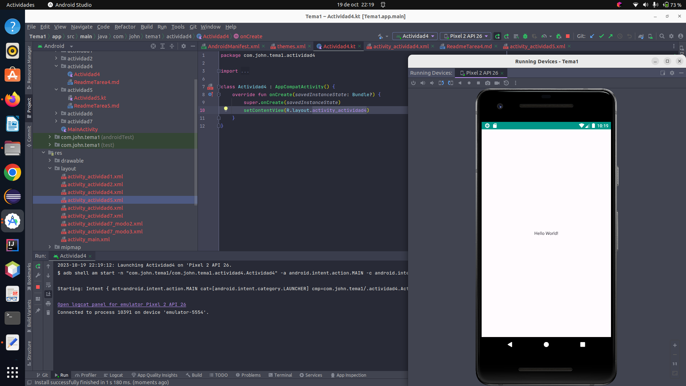

# Actividad 4


1. Trabajar con el manifest. Por ejemplo, declarar un segundo activity. Con un intent-filter,
   jugar a cambiar como primera pantalla el nuevo Activity.

* Acceder a la documentación que os he dejado sobre Manifest y verificar cada una de las opciones.


### 1: Trabajar con el manifest


### Creamos la Activity *actividad4*
```kotlin
class Actividad4 : AppCompatActivity() {
    override fun onCreate(savedInstanceState: Bundle?) {
        super.onCreate(savedInstanceState)
        setContentView(R.layout.activity_actividad4)
    }
}
```

Modificamos `themes.xml` que se encuentra en res/values/themes


```xml
<resources xmlns:tools="http://schemas.android.com/tools">
    <!-- Base application theme. -->
    <!-- Definir un nuevo color -->
    <color name="colorPrimary">#4BFF22</color>

    <!-- Definir otro color -->
    <color name="colorAccent">#CDDC39</color>
    <style name="Base.Theme.Tema1" parent="Theme.Material3.DayNight.NoActionBar">
        <!-- Customize your light theme here. -->
        <!-- <item name="colorPrimary">@color/my_light_primary</item> -->
        <item name="colorPrimary">@color/colorPrimary</item>
        <item name="colorPrimaryDark">#009688</item>
        <item name="colorAccent">@color/colorAccent</item>
    </style>

</resources>
```

En el androidManifest agregamos el thema
```codigo
android:theme="@style/Base.Theme.Tema1"
```

```xml
<?xml version="1.0" encoding="utf-8"?>
<manifest xmlns:android="http://schemas.android.com/apk/res/android"
    xmlns:tools="http://schemas.android.com/tools">

    <application
        android:allowBackup="true"
        android:dataExtractionRules="@xml/data_extraction_rules"
        android:fullBackupContent="@xml/backup_rules"
        android:icon="@mipmap/ic_launcher"
        android:label="@string/app_name"
        android:roundIcon="@mipmap/ic_launcher_round"
        android:supportsRtl="true"
        android:theme="@style/Base.Theme.Tema1"
        tools:targetApi="31">
        
        <activity
            android:name=".actividad4.Actividad4"
            android:exported="true">
            <intent-filter>
                <action android:name="android.intent.action.MAIN" />

                <category android:name="android.intent.category.LAUNCHER" />
            </intent-filter>
        </activity>
      
        <activity
            android:name=".MainActivity"
            android:exported="true">
            <intent-filter>
                <action android:name="android.intent.action.MAIN" />

                <category android:name="android.intent.category.LAUNCHER" />
            </intent-filter>
        </activity>
      
    </application>

</manifest>
```

Ejecutamos nuestro programa `Actividad4`




Vemos  que el thema cambia de colo.


Vemos que el thema cambia de color.