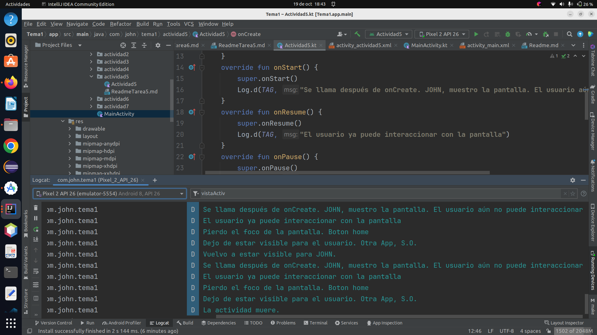
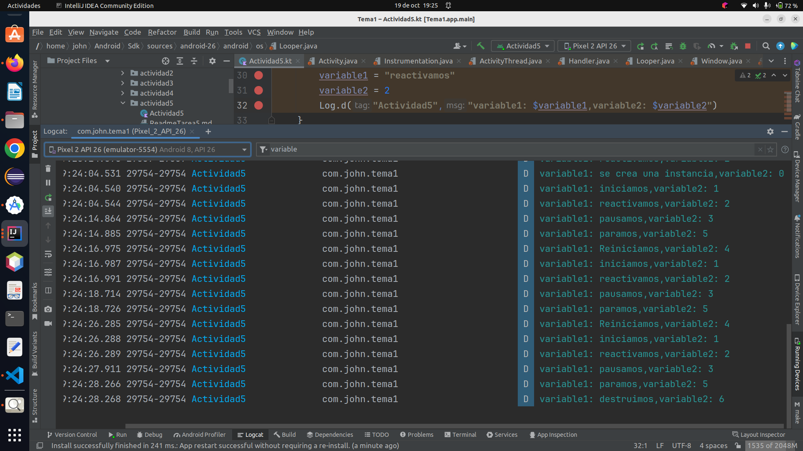

# Actividad 5

1.- Trabajar con el ciclo de vida de un activity. Sobreescribiremos todos los métodos del ciclo de 
vida y mediante Log, capturaremos lo que sucede.

2.- Realizar un debugger. Para ello:

* Crearos un par de variables y modificarla en cada uno de los métodos del activity. Ir ejecutando
  paso a paso y comprobando el estado de dichas variables.

3.- Crearos una clase llamada ClaseA que tenga tres atributos. Codificar dos constructores, los
getters/setters y el toString. Desde el método onStart(), crearos un objeto de la claseA, sesearlo
y realizar un Toast. Poner puntos de ruptura en cada método de la claseA y utilizar las opciones de
la depuración.

### 1: Trabajar con el Ciclo de Vida de un Activity

Sobreescribiremos todos los métodos del ciclo de vida de un Activity y utilizaremos Log para
capturar lo que sucede en cada uno de ellos. A continuación, se muestra un ejemplo de cómo hacerlo:

### Creamos la Activity *actividad5*
```kotlin
private const val TAG = "vistaActiv"
class Actividad5 : AppCompatActivity() {
    override fun onCreate(savedInstanceState: Bundle?) {
        super.onCreate(savedInstanceState)
        setContentView(R.layout.activity_actividad5)
    }
    override fun onStart() {
        super.onStart()
        Log.d(TAG, "Se llama después de onCreate. JOHN, muestro la pantalla. " +
                "El usuario aún no puede interaccionar")
    }
    override fun onResume() {
        super.onResume()
        Log.d(TAG, "El usuario ya puede interaccionar con la pantalla")
    }
    override fun onPause() {
        super.onPause()
        Log.d(TAG, "Pierdo el foco de la pantalla. Boton home")
    }
    override fun onRestart() {
        super.onRestart()
        Log.d(TAG, "Vuelvo a estar visible para JOHN.")
    }
    override fun onStop() {
        super.onStop()
        Log.d(TAG, "Dejo de estar visible para el usuario. Otra App, S.O.")
    }
    override fun onDestroy() {
        super.onDestroy()
        Log.d(TAG, "La actividad muere.")
    }

}
```

Ejecutamos nuestro programa `Actividad5`





2: Realizar un Debugger

Creamos un par de variables en la Activity y las modificamos en cada uno de los métodos del
ciclo de vida.
Luego, utilizamos el modo de depuración para ejecutar paso a paso y comprobar el estado de
esas variables.

Por ejemplo:

```kotlin
private const val TAG = "vistaActiv"
class Actividad5 : AppCompatActivity() {
    private  var variable1 = "inicio"
    private  var variable2 = 5
    override fun onCreate(savedInstanceState: Bundle?) {
        super.onCreate(savedInstanceState)
        setContentView(R.layout.activity_actividad5)
        variable1 = "se crea una instancia"
        variable2 = 0
        Log.d("Actividad5","variable1: $variable1,variable2: $variable2")
    }
    override fun onStart() {
        super.onStart()
        Log.d(TAG, "Se llama después de onCreate. JOHN, muestro la pantalla. " +
                "El usuario aún no puede interaccionar")
        variable1 = "iniciamos"
        variable2 = 1
        Log.d("Actividad5","variable1: $variable1,variable2: $variable2")
    }
    override fun onResume() {
        super.onResume()
        Log.d(TAG, "El usuario ya puede interaccionar con la pantalla")
        variable1 = "reactivamos"
        variable2 = 2
        Log.d("Actividad5","variable1: $variable1,variable2: $variable2")
    }
    override fun onPause() {
        super.onPause()
        Log.d(TAG, "Pierdo el foco de la pantalla. Boton home")
        variable1 = "pausamos"
        variable2 = 3
        Log.d("Actividad5","variable1: $variable1,variable2: $variable2")
    }
    override fun onRestart() {
        super.onRestart()
        Log.d(TAG, "Vuelvo a estar visible para JOHN.")
        variable1 = "Reiniciamos"
        variable2 = 4
        Log.d("Actividad5","variable1: $variable1,variable2: $variable2")
    }
    override fun onStop() {
        super.onStop()
        Log.d(TAG, "Dejo de estar visible para el usuario. Otra App, S.O.")
        variable1 = "paramos"
        variable2 = 5
        Log.d("Actividad5","variable1: $variable1,variable2: $variable2")
    }
    override fun onDestroy() {
        super.onDestroy()
        Log.d(TAG, "La actividad muere.")
        variable1 = "destruimos"
        variable2 = 6
        Log.d("Actividad5","variable1: $variable1,variable2: $variable2")
    }

}
```

Ejecutamos nuestro programa `Actividad5`



### 3: Crear una Clase Personalizada

Crearemos una clase personalizada llamada ClaseA. La clase tendrá tres atributos, dos constructores,
métodos getter/setter y una implementación del método toString. Luego, desde el método onStart() del
Activity, se creará un objeto de ClaseA, se configurará y se mostrará en un Toast. Se colocarán
puntos de ruptura en cada método de ClaseA y se utilizarán las opciones de depuración para
inspeccionar su comportamiento.

Por ejemplo:

```kotlin
private const val TAG = "vistaActiv"
class Actividad5 : AppCompatActivity() {
    private  var variable1 = "inicio"
    private  var variable2 = 5
    override fun onCreate(savedInstanceState: Bundle?) {
        super.onCreate(savedInstanceState)
        setContentView(R.layout.activity_actividad5)
        variable1 = "se crea una instancia"
        variable2 = 0
        Log.d("Actividad5","variable1: $variable1,variable2: $variable2")
    }
    override fun onStart() {
        super.onStart()
        Log.d(TAG, "Se llama después de onCreate. JOHN, muestro la pantalla. " +
                "El usuario aún no puede interaccionar")
        variable1 = "iniciamos"
        variable2 = 1
        Log.d("Actividad5","variable1: $variable1,variable2: $variable2")
        val objetoA = ClaseA("informatica", 2, 30)
        Log.d("MiActivity", objetoA.toString())
        Toast.makeText(this, objetoA.toString(), Toast.LENGTH_SHORT).show()
    }

    override fun onResume() {
        super.onResume()
        Log.d(TAG, "El usuario ya puede interaccionar con la pantalla")
        variable1 = "reactivamos"
        variable2 = 2
        Log.d("Actividad5","variable1: $variable1,variable2: $variable2")
    }
    override fun onPause() {
        super.onPause()
        Log.d(TAG, "Pierdo el foco de la pantalla. Boton home")
        variable1 = "pausamos"
        variable2 = 3
        Log.d("Actividad5","variable1: $variable1,variable2: $variable2")
    }
    override fun onRestart() {
        super.onRestart()
        Log.d(TAG, "Vuelvo a estar visible para JOHN.")
        variable1 = "Reiniciamos"
        variable2 = 4
        Log.d("Actividad5","variable1: $variable1,variable2: $variable2")
    }
    override fun onStop() {
        super.onStop()
        Log.d(TAG, "Dejo de estar visible para el usuario. Otra App, S.O.")
        variable1 = "paramos"
        variable2 = 5
        Log.d("Actividad5","variable1: $variable1,variable2: $variable2")
    }
    override fun onDestroy() {
        super.onDestroy()
        Log.d(TAG, "La actividad muere.")
        variable1 = "destruimos"
        variable2 = 6
        Log.d("Actividad5","variable1: $variable1,variable2: $variable2")
    }

}
class ClaseA{
    private var nombre = "clase1"
        get() {
            return field
        }
        set(value) {
            field = value
        }
    private var tamaño = 0
        get() {
            return field
        }
        set(value) {
            field = value
        }
    private var cantidad = 0
        get() {
            return field
        }
        set(value) {
            field = value
        }

    constructor(nombre: String, tamaño: Int, cantidad: Int) {
        this.nombre = nombre
        this.tamaño = tamaño
        this.cantidad = cantidad
    }

    constructor()

    override fun toString(): String {
        return "ClaseA(nombre='$nombre', tamaño=$tamaño, cantidad=$cantidad)"
    }


}
```

Ejecutamos nuestro programa `Actividad5`


[repository](https://github.com/johnlopez0505/Kotlin.git)