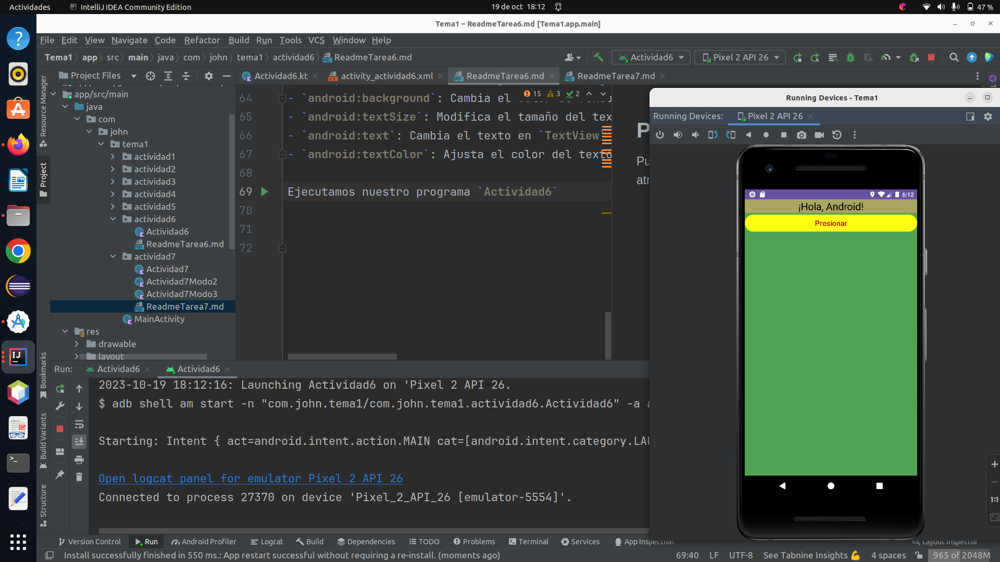

# Actividad 6

* Crearemos nuestro primer layout, pero emplearemos un color de fondo y un textView junto a un
  botón. Por ahora con un LinearLayout
* Jugar con los tamaños de textos.

### Creamos la Activity *actividad6*
```kotlin
class Actividad6 : AppCompatActivity() {
    private lateinit var boton : Button
    private lateinit var txtSaludo : TextView
    override fun onCreate(savedInstanceState: Bundle?) {
        super.onCreate(savedInstanceState)
        setContentView(R.layout.activity_actividad6)

        boton = findViewById(R.id.boton)
        txtSaludo = findViewById(R.id.text)
    }
    fun pulsarBoton(v : View){
        Toast.makeText(this,"que haces?", Toast.LENGTH_SHORT).show();
        txtSaludo.text = "Cambio de texto"
    }
}
```
## Creación del Layout XML:

<p>Abre el directorio de recursos de tu proyecto de Android en el explorador de archivos. 
Normalmente se encuentra en la carpeta res. Allí, crea un nuevo archivo XML para el diseño 
(por ejemplo, activity_mi_layout.xml) o modifica un archivo XML existente si prefieres. El 
diseño podría verse de la siguiente manera:</p><br>

```xml
<?xml version="1.0" encoding="utf-8"?>

<android:LinearLayout
        xmlns:app="http://schemas.android.com/apk/res-auto"
        xmlns:tools="http://schemas.android.com/tools" xmlns:android="http://schemas.
                        android.com/apk/res/android"
        android:layout_width="match_parent"
        android:layout_height="match_parent"
        android:orientation="vertical"
        android:background="#4FA453"
        tools:context=".actividad6.Actividad6" layout_height="match_parent" 
                        layout_width="match_parent">
    <TextView
            android:id="@+id/text"
            android:layout_width="match_parent"
            android:layout_height="wrap_content"
            android:text="¡Hola, Android!"
            android:textSize="24sp"
            android:textColor="#000000"
            android:background="#AAA562"
            android:gravity="center" />
    <Button
            android:id="@+id/boton"
            android:layout_width="match_parent"
            android:layout_height="wrap_content"
            android:text="Presionar"
            android:textSize="18sp" 
            android:backgroundTint="#FFF1"
            android:textColor="#C20847"
            android:onClick="pulsarBoton" />
</android:LinearLayout>
```

## Personalización
Puedes personalizar el diseño ajustando los siguientes atributos:
- `android:background`: Cambia el color de fondo del diseño.
- `android:textSize`: Modifica el tamaño del texto en `TextView` y el botón.
- `android:text`: Cambia el texto en `TextView` y el botón.
- `android:textColor`: Ajusta el color del texto en `TextView` y el botón.

Ejecutamos nuestro programa `Actividad6`


