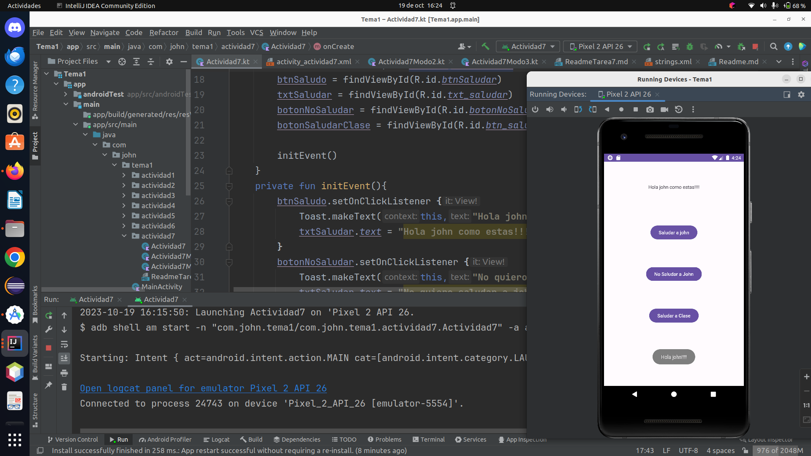
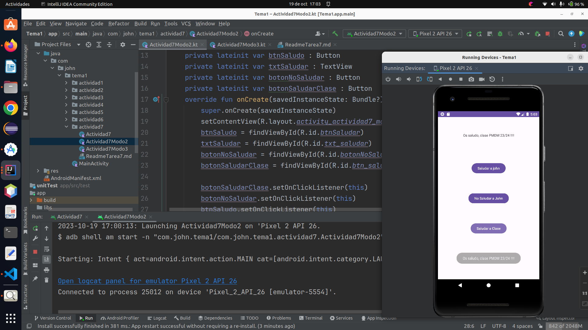

# Actividad 7

1. Trabajaremos con los eventos de los botones. Implementaremos un ejemplo, con tres botones.

    * saludar
    * no saludar
    * saludar a clase

* Tendremos que jugar con las tres formas de tratar los eventos de los botones:

    * Implementar dentro del xml, el método onclick="capturarEvento" en cada botón y desde la clase
      MainActivity, debemos de implementar ese método comprobando el "id" de cada uno de los botones.

    * Ahora toca hacerlo a partir del MainActivity, implementar de la interfaz ActionListener, por
      tanto debemos sobreescribir de manera explítica el método onclick(view:View). Dentro hay que
      comprobar el id de cada uno de los tres botones. Recordar que debemos quitar de cada botón la
      propiedad onclick. También, que hay que hacer un btn_1.setActionListener(this),
      tbn_2.setActionListener(this), tbn_3.setActionListener(this). La bala/cartucho, es el propio
      MainActivity.

    * Ahora toca con expresiones lambda. A cada botón, hay que cargarle su actionListener de manera
      individual, por tanto ponemos la expresión que hay que ejecutar en la invocación del onclick.

    * Realizar, capturas de pantalla personalizadas de las tres formas. Jugar con esto.

## Modo 1

### Creamos la Activity *actividad7*

```kotlin

class Actividad7 : AppCompatActivity() {
    private lateinit var btnSaludo : Button
    private lateinit var txtSaludar : TextView
    private lateinit var botonNoSaludar : Button
    private lateinit var botonSaludarClase : Button
    override fun onCreate(savedInstanceState: Bundle?) {
        super.onCreate(savedInstanceState)
        setContentView(R.layout.activity_actividad7)
        btnSaludo = findViewById(R.id.btnSaludar)
        txtSaludar = findViewById(R.id.txt_saludar)
        botonNoSaludar = findViewById(R.id.botonNoSaludar)
        botonSaludarClase = findViewById(R.id.btn_saludar_clase)

        initEvent()
    }
    private fun initEvent(){
        btnSaludo.setOnClickListener {
            Toast.makeText(this,"Hola john!!!!", Toast.LENGTH_LONG).show()
            txtSaludar.text = "Hola john como estas!!!!"
        }
        botonNoSaludar.setOnClickListener {
            Toast.makeText(this,"No quiero saludar a john!!!! ", Toast.LENGTH_LONG).show()
            txtSaludar.text = "No quiero saludar a john!!!!!!"
        }

        botonSaludarClase.setOnClickListener {
            Toast.makeText(this,"Os saludo, clase PMDM 23/24!!!!!!",Toast.LENGTH_LONG).show()
            txtSaludar.text= "Os saludo, clase PMDM 23/24!!!!!"
        }

    }

}
```
En el archivo xml de la actividad7 agregamos los botones y el Textview:

```xml
    <Button
        android:id="@+id/btnSaludar"
        android:layout_width="wrap_content"
        android:layout_height="wrap_content"
        android:text="@string/btnSaludar"
        app:layout_constraintBottom_toBottomOf="parent"

        app:layout_constraintEnd_toEndOf="parent"
        app:layout_constraintHorizontal_bias="0.5"
        app:layout_constraintStart_toStartOf="parent"
        app:layout_constraintTop_toTopOf="parent"
        app:layout_constraintVertical_bias="0.300" />

    <TextView
        android:id="@+id/txt_saludar"
        android:layout_width="wrap_content"
        android:layout_height="wrap_content"
        android:text="@string/hola"
        app:layout_constraintBottom_toBottomOf="parent"
        app:layout_constraintEnd_toEndOf="parent"
        app:layout_constraintHorizontal_bias="0.500"
        app:layout_constraintStart_toStartOf="parent"
        app:layout_constraintTop_toTopOf="parent"
        app:layout_constraintVertical_bias="0.100" />

    <Button
        android:id="@+id/botonNoSaludar"
        android:layout_width="wrap_content"
        android:layout_height="wrap_content"
        android:text="@string/no_saludar"
        app:layout_constraintBottom_toBottomOf="parent"

        app:layout_constraintEnd_toEndOf="parent"
        app:layout_constraintHorizontal_bias="0.5"
        app:layout_constraintStart_toStartOf="parent"
        app:layout_constraintTop_toTopOf="parent"
        app:layout_constraintVertical_bias="0.500"  />

    <Button
        android:id="@+id/btn_saludar_clase"
        android:layout_width="wrap_content"
        android:layout_height="wrap_content"
        android:text="@string/clase"
        app:layout_constraintBottom_toBottomOf="parent"

        app:layout_constraintEnd_toEndOf="parent"
        app:layout_constraintHorizontal_bias="0.5"
        app:layout_constraintStart_toStartOf="parent"
        app:layout_constraintTop_toTopOf="parent"
        app:layout_constraintVertical_bias="0.700"  />
```
También en el fichero `strings.xml`, en la carpeta values le damos
nombre a nuestros botones:

```xml
<resources>
    <string name="btnSaludar">Saludar a john</string>
    <string name="hola">!Hello Word</string>
    <string name="app_name">aplicacion</string>
    <string name="no_saludar">No Saludar a John</string>
    <string name="clase">Saludar a Clase</string>
</resources>
```
Ejecutamos nuestro programa `Actividad7`


Ahora vamos a pulsar en el boton `saludar a john`:



Vemos que al pulsar el boton `saludar a john` se muestra el mensaje
en pantalla.

Ahora vamos a pulsar en el boton `no saludar a john`:


Vemos que al pulsar el boton `no saludar a john` se muestra el mensaje
en pantalla.


Ahora vamos a pulsar en el boton `saludar a clase`:


Vemos que al pulsar el boton `saludar a clase` se muestra el mensaje
en pantalla.

## Descripción
Esta actividad de Android es parte de una aplicación móvil y proporciona una interfaz de usuario
simple con botones y un TextView. Los botones permiten al usuario interactuar con la aplicación
haciendo clic en ellos y generando mensajes de saludo o de otro tipo en función de la acción
realizada.

## Componentes de la Actividad
- `btnSaludo`: Un botón que genera un mensaje de saludo cuando se hace clic en él.
- `txtSaludar`: Un TextView que muestra mensajes de saludo.
- `botonNoSaludar`: Un botón que genera un mensaje cuando el usuario decide no saludar.
- `botonSaludarClase`: Un botón que saluda a una clase específica.

## Funcionamiento
1. Cuando la actividad se crea, se inicializan los componentes de la interfaz de usuario y se
   configuran los eventos.

2. Cuando el botón `btnSaludo` se presiona, se muestra un mensaje de saludo "Hola John!!!!" en un
   cuadro de mensaje emergente (Toast) y se actualiza el contenido del `txtSaludar` con "Hola John
   como estas!!!!".

3. Cuando el botón `botonNoSaludar` se presiona, se muestra un mensaje "No quiero saludar a
   John!!!!" en un cuadro de mensaje emergente y se actualiza el contenido de `txtSaludar` con
   "No quiero saludar a John!!!!!!".

4. Cuando el botón `botonSaludarClase` se presiona, se muestra un mensaje "Os saludo, clase PMDM
   23/24!!!!!!" en un cuadro de mensaje emergente y se actualiza el contenido de `txtSaludar` con
   "Os saludo, clase PMDM 23/24!!!!!".


## Notas
- Este código está escrito en lenguaje Kotlin, que es el lenguaje de programación oficial para el
  desarrollo de aplicaciones de Android.
- Los mensajes de saludo y otros mensajes se muestran en cuadros de mensaje emergente (Toast) para
  proporcionar una experiencia interactiva al usuario.


## Modo 2

### Creamos la Activity *actividad7Modo2*

```kotlin
class Actividad7Modo2 : AppCompatActivity(), OnClickListener {
    private lateinit var btnSaludo : Button
    private lateinit var txtSaludar : TextView
    private lateinit var botonNoSaludar : Button
    private lateinit var botonSaludarClase : Button
    override fun onCreate(savedInstanceState: Bundle?) {
        super.onCreate(savedInstanceState)
        setContentView(R.layout.activity_actividad7_modo2)
        btnSaludo = findViewById(R.id.btnSaludar)
        txtSaludar = findViewById(R.id.txt_saludar)
        botonNoSaludar = findViewById(R.id.botonNoSaludar)
        botonSaludarClase = findViewById(R.id.btn_saludar_clase)

        botonSaludarClase.setOnClickListener(this)
        botonNoSaludar.setOnClickListener(this)
        btnSaludo.setOnClickListener(this)
    }


    override fun onClick(v1: View) {
        if(v1.id == R.id.btn_saludar_clase){
            Toast.makeText(this,"Os saludo, clase PMDM 23/24 !!!!",Toast.LENGTH_LONG).show()
            txtSaludar.text= "Os saludo, clase PMDM 23/24 !!!!"
        }
        if(v1.id == R.id.botonNoSaludar){
            Toast.makeText(this,"No quiero saludar a john!!!! ", Toast.LENGTH_LONG).show()
            txtSaludar.text = "No quiero saludar a john!!!!!!"
        }
        if(v1.id == R.id.btnSaludar){
            Toast.makeText(this,"Hola john!!!!", Toast.LENGTH_LONG).show()
            txtSaludar.text = "Hola john como estas!!!!"
        }

    }
}
```
En el archivo xml de la actividad7Modo2 agregamos los botones y el Textview:

```xml
    <Button
        android:id="@+id/btnSaludar"
        android:layout_width="wrap_content"
        android:layout_height="wrap_content"
        android:text="@string/btnSaludar"
        app:layout_constraintBottom_toBottomOf="parent"

        app:layout_constraintEnd_toEndOf="parent"
        app:layout_constraintHorizontal_bias="0.5"
        app:layout_constraintStart_toStartOf="parent"
        app:layout_constraintTop_toTopOf="parent"
        app:layout_constraintVertical_bias="0.300" />

    <TextView
        android:id="@+id/txt_saludar"
        android:layout_width="wrap_content"
        android:layout_height="wrap_content"
        android:text="@string/hola"
        app:layout_constraintBottom_toBottomOf="parent"
        app:layout_constraintEnd_toEndOf="parent"
        app:layout_constraintHorizontal_bias="0.500"
        app:layout_constraintStart_toStartOf="parent"
        app:layout_constraintTop_toTopOf="parent"
        app:layout_constraintVertical_bias="0.100" />

    <Button
        android:id="@+id/botonNoSaludar"
        android:layout_width="wrap_content"
        android:layout_height="wrap_content"
        android:text="@string/no_saludar"
        app:layout_constraintBottom_toBottomOf="parent"

        app:layout_constraintEnd_toEndOf="parent"
        app:layout_constraintHorizontal_bias="0.5"
        app:layout_constraintStart_toStartOf="parent"
        app:layout_constraintTop_toTopOf="parent"
        app:layout_constraintVertical_bias="0.500"  />

    <Button
        android:id="@+id/btn_saludar_clase"
        android:layout_width="wrap_content"
        android:layout_height="wrap_content"
        android:text="@string/clase"
        app:layout_constraintBottom_toBottomOf="parent"

        app:layout_constraintEnd_toEndOf="parent"
        app:layout_constraintHorizontal_bias="0.5"
        app:layout_constraintStart_toStartOf="parent"
        app:layout_constraintTop_toTopOf="parent"
        app:layout_constraintVertical_bias="0.700"  />
```
También en el fichero `strings.xml`, en la carpeta values le damos
nombre a nuestros botones:

```xml
<resources>
    <string name="btnSaludar">Saludar a john</string>
    <string name="hola">!Hello Word</string>
    <string name="app_name">aplicacion</string>
    <string name="no_saludar">No Saludar a John</string>
    <string name="clase">Saludar a Clase</string>
</resources>
```
Ejecutamos nuestro programa `Actividad7Modo2`


Ahora vamos a pulsar en el boton `saludar a john`:


Vemos que al pulsar el boton `saludar a john` se muestra el mensaje
en pantalla.

Ahora vamos a pulsar en el boton `no saludar a john`:



Vemos que al pulsar el boton `no saludar a john` se muestra el mensaje
en pantalla.


Ahora vamos a pulsar en el boton `saludar a clase`:


Vemos que al pulsar el boton `saludar a clase` se muestra el mensaje
en pantalla.

## Descripción
Este programa es una actividad de Android escrita en Kotlin que muestra una interfaz de usuario con
botones y un TextView. La actividad responde a eventos de clic en los botones para mostrar mensajes
de saludo y actualiza el contenido del TextView.

## Componentes de la Interfaz de Usuario
- `btnSaludo`: Un botón que genera un mensaje de saludo cuando se hace clic en él.
- `txtSaludar`: Un TextView que muestra mensajes de saludo.
- `botonNoSaludar`: Un botón que genera un mensaje cuando el usuario decide no saludar.
- `botonSaludarClase`: Un botón que saluda a una clase específica.

## Funcionamiento
1. **Declaración de Variables y Componentes de la Interfaz de Usuario:**
    - Se declaran las variables `btnSaludo`, `txtSaludar`, `botonNoSaludar` y `botonSaludarClase`
      para representar los componentes de la interfaz de usuario.
    - Estas variables se declaran como propiedades `lateinit`, lo que significa que se inicializarán
      más tarde en el código.

2. **Inicialización de la Actividad:**
    - El método `onCreate` se ejecuta al crearse la actividad.
    - Se llama al constructor de la superclase `AppCompatActivity` para la inicialización básica.
    - Se configura el contenido de la actividad utilizando `setContentView` para asociarla con un
      archivo de diseño (`activity_actividad7_modo2.xml`) que define la interfaz de usuario.

3. **Inicialización de Componentes de la Interfaz de Usuario:**
    - Se inicializan las variables `btnSaludo`, `txtSaludar`, `botonNoSaludar` y `botonSaludarClase`
      utilizando `findViewById` para enlazarlas con los elementos de la interfaz de usuario
      definidos en el archivo de diseño.

4. **Asociación de Eventos de Clic:**
    - Se asocian eventos de clic a los botones utilizando `setOnClickListener(this)` debido a que
      la actividad implementa la interfaz `OnClickListener`, lo que permite gestionar los eventos
      de clic de manera estructurada.

5. **Gestión de Eventos de Clic (onClick):**
    - El método `onClick` se ejecuta cuando se hace clic en uno de los botones, y el parámetro `v1`
      de tipo `View` identifica el botón presionado.
    - Se utiliza una estructura condicional para determinar cuál de los botones se ha presionado
      según su ID.

6. **Mensajes y Actualización de TextView:**
    - Según el botón presionado, se muestra un mensaje correspondiente utilizando `Toast.makeText`,
      que muestra un cuadro de mensaje emergente.
    - El contenido del `txtSaludar` se actualiza con un mensaje apropiado utilizando la propiedad
      `text`.


## Notas
- Este código está escrito en lenguaje Kotlin, que es el lenguaje de programación oficial para el
  desarrollo de aplicaciones de Android.
- Los mensajes de saludo y otros mensajes se muestran en cuadros de mensaje emergente (Toast) para
  proporcionar una experiencia interactiva al usuario.

## Modo 3

### Creamos la Activity *actividad7Modo3*

```kotlin
class Actividad7Modo3 : AppCompatActivity() {
    private lateinit var btnSaludo : Button
    private lateinit var txtSaludar : TextView
    private lateinit var botonNoSaludar : Button
    private lateinit var botonSaludarClase : Button
    override fun onCreate(savedInstanceState: Bundle?) {
        super.onCreate(savedInstanceState)
        setContentView(R.layout.activity_actividad7_modo3)

        btnSaludo = findViewById(R.id.btnSaludar)
        txtSaludar = findViewById(R.id.txt_saludar)
        botonNoSaludar = findViewById(R.id.botonNoSaludar)
        botonSaludarClase = findViewById(R.id.btn_saludar_clase)

    }

    fun btnSaludar(v1: View) {
        if(v1.id == R.id.btnSaludar){
            Toast.makeText(this,"Hola john!!!!", Toast.LENGTH_LONG).show()
            txtSaludar.text = "Hola john como estas!!!!"
        }
        if(v1.id == R.id.botonNoSaludar){
            Toast.makeText(this,"No quiero saludar a john!!!! ", Toast.LENGTH_LONG).show()
            txtSaludar.text = "No quiero saludar a john!!!!!!"
        }
        if(v1.id == R.id.btn_saludar_clase){
            Toast.makeText(this,"Os saludo, clase PMDM 23/24 !!!!",Toast.LENGTH_LONG).show()
            txtSaludar.text= "Os saludo, clase PMDM 23/24 !!!!"
        }
    }

}
```
En el archivo xml de la actividad7Modo3 agregamos los botones y el Textview:

```xml
    <Button
        android:id="@+id/btnSaludar"
        android:layout_width="wrap_content"
        android:layout_height="wrap_content"
        android:text="@string/btnSaludar"
        android:onClick="btnSaludar"
        app:layout_constraintBottom_toBottomOf="parent"

        app:layout_constraintEnd_toEndOf="parent"
        app:layout_constraintHorizontal_bias="0.5"
        app:layout_constraintStart_toStartOf="parent"
        app:layout_constraintTop_toTopOf="parent"
        app:layout_constraintVertical_bias="0.300" />

    <TextView
        android:id="@+id/txt_saludar"
        android:layout_width="wrap_content"
        android:layout_height="wrap_content"
        android:text="@string/hola"
        app:layout_constraintBottom_toBottomOf="parent"
        app:layout_constraintEnd_toEndOf="parent"
        app:layout_constraintHorizontal_bias="0.500"
        app:layout_constraintStart_toStartOf="parent"
        app:layout_constraintTop_toTopOf="parent"
        app:layout_constraintVertical_bias="0.100" />
        
    <Button
        android:id="@+id/botonNoSaludar"
        android:layout_width="wrap_content"
        android:layout_height="wrap_content"
        android:text="@string/no_saludar"
        android:onClick="btnSaludar"
        app:layout_constraintBottom_toBottomOf="parent"
        
        app:layout_constraintEnd_toEndOf="parent"
        app:layout_constraintHorizontal_bias="0.5"
        app:layout_constraintStart_toStartOf="parent"
        app:layout_constraintTop_toTopOf="parent"
        app:layout_constraintVertical_bias="0.500"  />
        
    <Button
        android:id="@+id/btn_saludar_clase"
        android:layout_width="wrap_content"
        android:layout_height="wrap_content"
        android:text="@string/clase"
        android:onClick="btnSaludar"
        app:layout_constraintBottom_toBottomOf="parent"
        
        app:layout_constraintEnd_toEndOf="parent"
        app:layout_constraintHorizontal_bias="0.5"
        app:layout_constraintStart_toStartOf="parent"
        app:layout_constraintTop_toTopOf="parent"
        app:layout_constraintVertical_bias="0.700"  />

```
También en el fichero `strings.xml`, en la carpeta values le damos
nombre a nuestros botones:

```xml
<resources>
    <string name="btnSaludar">Saludar a john</string>
    <string name="hola">!Hello Word</string>
    <string name="app_name">aplicacion</string>
    <string name="no_saludar">No Saludar a John</string>
    <string name="clase">Saludar a Clase</string>
</resources>
```
Ejecutamos nuestro programa `Actividad7Modo3`


Ahora vamos a pulsar en el boton `saludar a john`:


Vemos que al pulsar el boton `saludar a john` se muestra el mensaje
en pantalla.

Ahora vamos a pulsar en el boton `no saludar a john`:


Vemos que al pulsar el boton `no saludar a john` se muestra el mensaje
en pantalla.


Ahora vamos a pulsar en el boton `saludar a clase`:


Vemos que al pulsar el boton `saludar a clase` se muestra el mensaje
en pantalla.

## Descripción
Este programa es una actividad de Android escrita en Kotlin que proporciona una interfaz de usuario
con botones y un TextView. La actividad responde a eventos de clic en los botones para mostrar
mensajes de saludo y actualiza el contenido del TextView.

## Componentes de la Interfaz de Usuario
- `btnSaludo`: Un botón que genera un mensaje de saludo cuando se hace clic en él.
- `txtSaludar`: Un TextView que muestra mensajes de saludo.
- `botonNoSaludar`: Un botón que genera un mensaje cuando el usuario decide no saludar.
- `botonSaludarClase`: Un botón que saluda a una clase específica.

## Funcionamiento
1. **Declaración de Variables y Componentes de la Interfaz de Usuario:**
    - Se declaran las variables `btnSaludo`, `txtSaludar`, `botonNoSaludar` y `botonSaludarClase`
      para representar los componentes de la interfaz de usuario, como botones y TextView.
    - Estas variables se declaran como propiedades `lateinit`, lo que significa que se inicializarán
      más tarde en el código.

2. **Inicialización de la Actividad:**
    - El método `onCreate` se ejecuta al crearse la actividad.
    - Se llama al constructor de la superclase `AppCompatActivity` para la inicialización básica.
    - Se configura el contenido de la actividad utilizando `setContentView` para asociarla con un
      archivo de diseño (`activity_actividad7_modo3.xml`) que define la interfaz de usuario.

3. **Inicialización de Componentes de la Interfaz de Usuario:**
    - Se inicializan las variables `btnSaludo`, `txtSaludar`, `botonNoSaludar` y `botonSaludarClase`
      utilizando `findViewById` para enlazarlas con los elementos de la interfaz de usuario
      definidos en el archivo de diseño.

4. **Función `btnSaludar` para Gestionar Eventos de Clic:**
    - Se define la función `btnSaludar(v1: View)` para gestionar los eventos de clic en los botones.
      La función toma un parámetro `v1` de tipo `View` para identificar el botón presionado.

5. **Gestión de Eventos de Clic:**
    - Dentro de la función `btnSaludar`, se utiliza una estructura condicional para determinar cuál
      de los botones se ha presionado según su ID.
    - En función del botón presionado, se muestra un mensaje correspondiente utilizando
      `Toast.makeText`, que muestra un cuadro de mensaje emergente.
    - El contenido del `txtSaludar` se actualiza con un mensaje apropiado utilizando la propiedad
      `text`.


## Notas
- Este código está escrito en lenguaje Kotlin, que es el lenguaje de programación oficial para el
  desarrollo de aplicaciones de Android.
- Los mensajes de saludo y otros mensajes se muestran en cuadros de mensaje emergente (Toast) para
  proporcionar una experiencia interactiva al usuario.


[repositorio](https://github.com/johnlopez0505/Kotlin.git)

